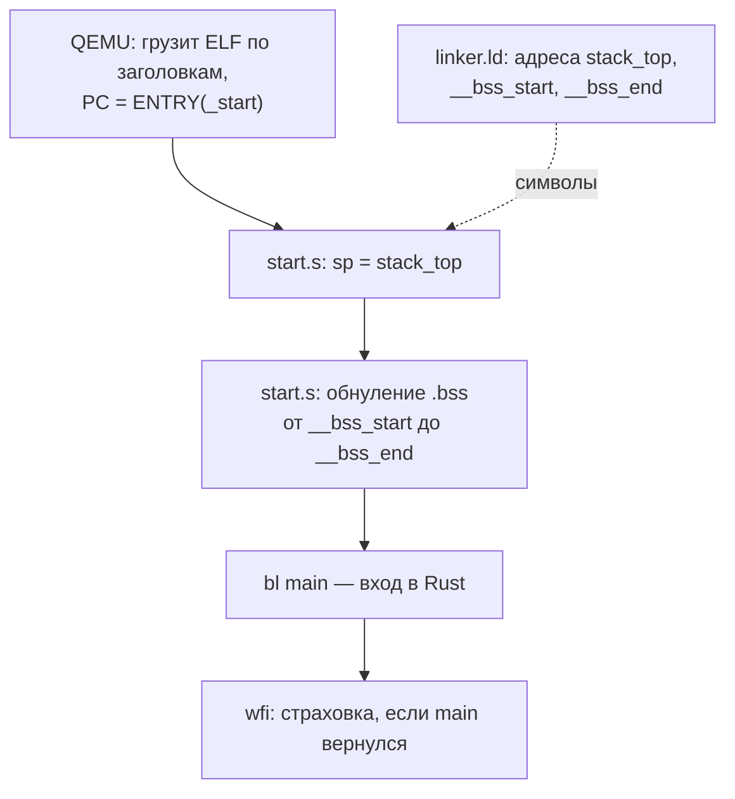

# Путь от включения до main

> [!abstract] Суть
> В `aarch64-unknown-none` нет ни ОС, ни crt0: никто сам не выставит стек, не обнулит `.bss` и не позовёт `main`. Эту работу делает `_start` (`src/start.s`) — первый исполняемый код. Раскладку по памяти ему диктует linker.ld — [[linker_script]].

## Кто кого запускает

## Шаги _start и почему именно в этом порядке

1. **Стек (`sp = stack_top`)** — до любой `bl`: без корректного `sp` нельзя вызывать функции и заводить локальные кадры. Стек растёт вниз, ABI требует выравнивание на 16.
2. **Обнуление `.bss`** — секция NOBITS: в ELF-файле её содержимого нет, там мусор; Rust ожидает нули в static. `stp xzr` пишет по 16 байт — детали кратности в [[bss_alignment]].
3. **`bl main`** — окружение минимально корректно. Символ должен быть ровно `main` — поэтому `#[unsafe(no_mangle)]` и `extern "C"`.
4. **`wfi`-цикл** — страховка на случай возврата.

Укрепления входа (парковка ядер, `daifset`) — [[entry_hygiene]].

> [!warning] Почему на ассемблере
> Пока нет корректного `sp`, Rust-функция не может «начаться»: нельзя гарантировать, что код до настройки стека не обратится к стеку. Первые инструкции пишут руками, с точным контролем каждой.

> [!question] Для самопроверки
> - Почему `b.hs`/`b.lo`, а не `b.ge`/`b.lt`?
> - Что сломается, если поменять местами шаги 1 и 2?
> - Откуда QEMU знает, с какого адреса начинать исполнение?

> [!question] Частое заблуждение
> «_start обнуляет регистры и всю память». Нет: регистры не инициализируются (кроме `sp`), а обнуляется **только `.bss`** — от `__bss_start` до `__bss_end`. `xzr` в `stp` — не очищаемый регистр, а аппаратный регистр-ноль: он всегда читается как 0. Остальные секции не трогаются: их содержимое либо из ELF-файла (`.text`, `.rodata`, `.data`), либо безразлично до первого push (стек).

## Источники
- Arm ARM: MPIDR, DAIF, ABI для AArch64 (выравнивание SP)
- GNU as: синтаксис AArch64

## Связанные заметки
- [[linker_script]], [[entry_hygiene]], [[bss_alignment]], [[qemu_adaptation]]
