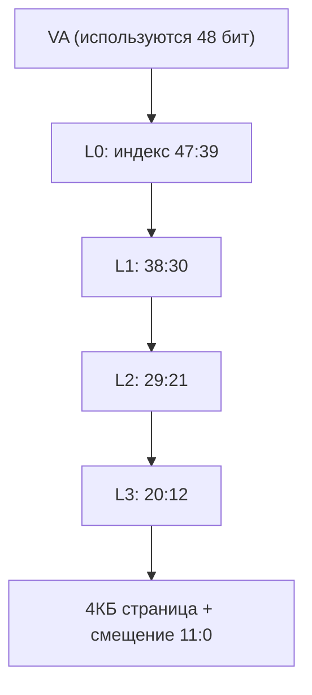

# MMU: зачем и как устроен перевод адресов

> [!abstract] Суть
> MMU переводит виртуальные адреса в физические через многоуровневые таблицы страниц. Три выгоды: права доступа по регионам, атрибуты памяти (Device для MMIO, Cacheable для RAM), развязка линк-адреса и размещения. План этапа 2: identity map (VA = PA), затем heap.

## Зачем MMU в этом проекте
- **Права**: код/rodata — read-only + execute, данные — rw, MMIO — rw без исполнения.
- **Атрибуты**: MMIO = Device (запрет кэширования/переупорядочивания на шине) — на реальном железе `volatile` без этого недостаточен; RAM = Normal Cacheable.
- **Развязка адресов**: позднее размещение образа где угодно без пересборки.

## Уровни трансляции (ARMv8-A, granule 4КБ)

- Таблицы — массивы 64-битных дескрипторов по 4096 записей (4 КБ на таблицу).
- L0 — только Table (указатель на следующую таблицу); L1/L2 — Table или Block (1 ГБ / 2 МБ); L3 — только страницы 4 КБ.
- В дескрипторе: Valid, AP (права), PXN/UXN (запрет исполнения), AF, индекс MAIR (тип памяти).

## Регистры включения

| Регистр | Роль |
|---|---|
| TTBR0_EL1 | база L0-таблицы (нижняя половина VA) |
| TCR_EL1 | параметры: TSZ, granule, shareability |
| MAIR_EL1 | кодировки типов (Normal, Device) |
| SCTLR_EL1 | бит M — включение MMU (+ C/I — кэши) |

## Задания этапа 2
1. Карта памяти: символы линкера из Rust, печать baseline ([[linker_script]]) — ✅
2. Identity map: таблицы в статике, дескрипторы RAM+MMIO, TTBR0/TCR/MAIR/SCTLR — ✅ (MMU включён, 2026-10)
3. Heap: регион в linker.ld, bump-аллокатор, `alloc` (Box/Vec) — ✅ (первое выделение: __heap_start, val=24)

> [!warning] Подводные камни
> - Без VBAR_EL1 (этап 3) ошибка трансляции = тихое зависание: векторы по сбросу на 0x0, там нет кода. Поэтому печать и baseline делаются ДО включения MMU.
> - MMIO обязателен в identity map с Device-атрибутом: без него на железе записи в UART могут кэшироваться/переупорядочиваться.
> - Таблицы страниц выравниваются на гранулярность (4 КБ).

> [!question] Самопроверка
> - Сколько памяти занимает полный путь L0→L3 для одной страницы? (4 таблицы × 4 КБ)
> - Почему identity map — правильный первый шаг?
> - Почему Block-дескрипторы выгоднее для RAM до heap-этапа?

## Источники
- Arm ARM (DDI 0487): перевод адресов, дескрипторы, TTBR/TCR/MAIR/SCTLR
- AArch64: 4-уровневая трансляция, granule 4 КБ

## Связанные заметки
- [[address_sources]], [[mmio_basics]], [[0001_output_first]], [[linker_script]]
