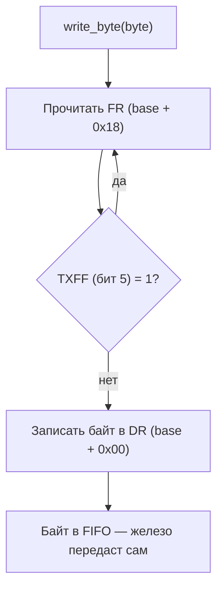

# UART PL011: модель регистров

> [!abstract] Суть
> PL011 — memory-mapped периферия: передача байта = опрос флага TXFF (FIFO не полон) + запись в регистр данных DR. `volatile` обязателен: без него оптимизатор кэширует чтение FR, и цикл ожидания зависает навсегда.

## Регистры передачи

| Регистр | Смещение | Назначение |
|---|---|---|
| DR (Data) | `+0x00` | запись = положить байт в TX FIFO (16 байт) |
| FR (Flags) | `+0x18` | флаги: TXFF бит 5 (FIFO полон), BUSY бит 3 (передаёт), TXFE бит 7 (FIFO пуст), RXFE бит 4 |

## Алгоритм write_byte

Опрашивать TXFF, а не BUSY: FIFO — очередь, следующий байт кладётся, пока предыдущий уходит по проводу. BUSY-опрос нужен для семантики «всё отправлено» (перед выключением/перенастройкой UART).

> [!warning] Подводные камни
> - Без `volatile` оптимизатор вынесет чтение FR из цикла: «прочитал раз и висим вечно». В QEMU не проявится — там TXFF всегда 0 (stdout не переполняется).
> - Запись в DR при полном FIFO на реальном железе = байт молча теряется. Симптом: «в QEMU работает, на плате мусор».
> - На железе UART ещё надо включить (CR: UARTEN + TXE, скорость IBRD/FBRD). В QEMU модель упрощена — DR-запись сразу идёт в stdout; на плате init уже сделает U-Boot.

> [!question] Для самопроверки
> - Почему после `write_byte` байт гарантированно в UART, но не гарантированно «в проводе»?
> - Когда опрос BUSY нужен, а TXFF — нет?

## Источники
- ARM PL011 TRM (ARM DDI 0183): регистры DR/FR, FIFO
- QEMU: модель pl011 (hw/char/pl011.c)

## Связанные заметки
- [[qemu_adaptation]], [[multicore_path]], [[0001_output_first]]
