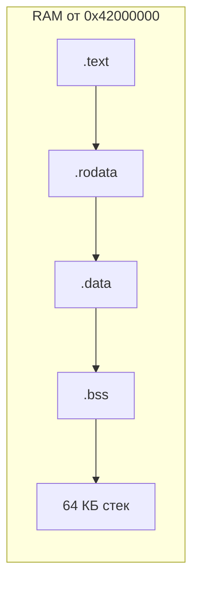

# Зачем нужен linker.ld

> [!abstract] Суть
> Дефолтный скрипт линковки рассчитан на процесс под Linux. Для bare-metal нужен свой: он задаёт, по какому адресу ляжет образ и в каком порядке встанут секции. QEMU `-kernel` и U-Boot кладут ELF по адресам из заголовков — их формирует именно этот файл.

## Карта памяти



## Разбор по строкам

| Строка | Смысл | Нюансы |
|---|---|---|
| `ENTRY(_start)` | символ точки входа → поле `e_entry` | без неё lld берёт начало `.text` |
| `. = 0x42000000;` | счётчик адреса: начало образа | все символы разрешаются от этой базы — [[load_address]] |
| `.text : { *(.text._start) ... }` | код; `_start` первым | точка входа в начале образа — важно для raw-бинарника и `go` |
| `.rodata` / `.data` | константы / инициализированные static | копировать `.data` не нужно: LMA = VMA |
| `.bss : { __bss_start = .; ... __bss_end = .; }` | NOBITS: в файле только размер и адрес | содержимое — мусор, обнуляет `_start`; символы — контракт с ассемблером |
| `. = . + 0x10000; stack_top = .;` | резерв 64 КБ под стек | растёт вниз → символ — верхняя граница; `ALIGN(16)` обязателен (ABI) |

## Контракт файлов

| Кто | Что даёт | Что берёт |
|---|---|---|
| `linker.ld` | `_start` в начале образа, адреса символов | имена символов из `start.s` |
| `start.s` | использование символов (`=stack_top` и др.) | адреса от линкера |

Проверить результат можно самому:

```bash
llvm-readelf -h <elf>   # Entry point
llvm-readelf -S <elf>   # секции, адреса, размер .bss
llvm-nm <elf>           # значения символов
```

> [!warning] Подводные камни
> - Адрес загрузки ≠ базе линковки → абсолютные адреса мимо ([[load_address]]).
> - Не выровненный `sp` → fault при первом обращении к стеку.
> - `.bss` не кратна 16 при `stp`-цикле → запись за границей ([[bss_alignment]]).

## Связанные заметки
- [[boot_flow]], [[load_address]], [[bss_alignment]], [[qemu_adaptation]], [[uboot_loading]]
