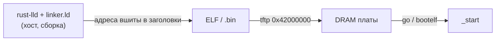

# Как U-Boot загружает наш образ

> [!abstract] Суть
> U-Boot не видит linker.ld и не «вызывает» его: скрипт срабатывает один раз на хосте при линковке, вшивая адреса в ELF/binary. U-Boot лишь кладёт файл в DRAM и прыгает — всё остальное (стек, .bss) обязан сделать `_start`.

## Путь образа

## Два способа запуска

| Способ | Что делает U-Boot | Роль linker.ld |
|---|---|---|
| `tftp 0x42000000 fw.bin` + `go 0x42000000` | прыгает на адрес, файл не анализирует | сырой `.bin` должен быть загружен ровно по базе линковки — совпадение проверяете вы |
| `tftp ... fw.elf` + `bootelf` | раскладывает сегменты по `p_vaddr`, прыгает на `e_entry` | адреса уже в заголовках — U-Boot им следует |

- `go` с ELF-файлом не работает: первые байты файла — заголовки ELF, а не код.
- Сырой `.bin` начинается ровно с `_start`, потому что linker.ld кладёт `*(.text._start)` первым; у `.bin` нет `e_entry`, первая инструкция = точка входа.
- QEMU `-kernel` ведёт себя как «bootelf без U-Boot» — сам читает `e_entry`.

## Что U-Boot НЕ делает при `go`

- не обнуляет `.bss` → делает `start.s` ([[boot_flow]]);
- не настраивает стек под payload → `sp` выставляет `start.s`;
- не гарантирует DAIF и уровень EL → страховка в [[entry_hygiene]];
- кладёт в `x0`/`x1` argc/argv, DTB регистром не передаёт ([[qemu_adaptation]]).

> [!warning] Подводные камни
> - `go` на адрес ≠ база линковки → `ldr =symbol` указывает мимо: мусор в UART или прыжок в ноль ([[load_address]]). Ошибки сборки не будет.
> - `go` на ELF-файл → прыжок в заголовки вместо кода.

> [!question] Для самопроверки
> - Где физически «живёт» linker.ld после сборки?
> - Почему QEMU не нужен `go`?
> - Какие два действия `_start` компенсируют «невнимательность» U-Boot при `go`?

## Источники
- U-Boot docs: `go` (do_go_exec), `bootelf` (CONFIG_CMD_ELF), TFTP
- README проекта: сценарий `tftp 0x42000000`

## Связанные заметки
- [[linker_script]], [[load_address]], [[boot_flow]], [[entry_hygiene]], [[qemu_adaptation]]
